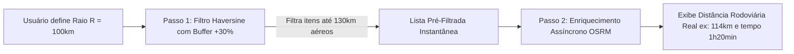

# 01. Arquitetura e Conceitos: Filtro por Raio Geográfico

Este documento detalha o funcionamento conceitual e a arquitetura técnica da funcionalidade de **Filtragem por Raio Geográfico**.

---

## 🎯 Conceitos Fundamentais

O filtro por raio funciona calculando a distância entre um **Ponto de Origem (Ponto de Referência / Sede)** e um ou mais **Pontos de Destino (Registros / Cidades / Oportunidades)**.

```
       [ PONTO A: REFERÊNCIA / SEDE ] (ex: São Paulo, SP ou Santa Cruz do Rio Pardo, SP)
                               |
                    +----------+----------+
                    |  Raio R  | (ex: 150 km)
                    v          v
     [ Destino 1: 45 km ]    [ Destino 2: 120 km ]    [ Destino 3: 210 km ]
          (INCLUSO)               (INCLUSO)                (EXCLUÍDO)
```

### 1. Ponto de Referência (Origem - Ponto A)
É a coordenada central a partir da qual o raio é medido. Pode ser:
- **Fixo**: Configurado no arquivo de ambiente (`.env`) ou banco de dados (ex: Sede da Empresa / Filial).
- **Dinâmico (Usuário)**: Selecionado pelo usuário na UI (ex: Cidade de Origem escolhida via dropdown ou Geolocalização do navegador GPS).

### 2. Pontos de Destino (Destinos - Pontos B)
São os registros listados na aplicação (licitações, clientes, imóveis, entregas, eventos). Cada registro deve conter:
- Latitude e Longitude diretas (`latitude`, `longitude`), OU
- Código do Município IBGE (`codigo_ibge`), OU
- Nome da Cidade e Estado (`municipio`, `uf`).

---

## 📐 Comparativo: Haversine vs. Rota Rodoviária (OSRM)

Existem duas abordagens para calcular distâncias na aplicação:

| Característica | Fórmula Haversine (Raio Aéreo) | Rota Rodoviária (OSRM / OpenStreetMap) |
| :--- | :--- | :--- |
| **Tipo de Distância** | Em linha reta (Grande Círculo na esfera terrestre) | Malha rodoviária real (estradas, rodovias e caminhos) |
| **Velocidade** | **Ultra-rápido** (< 1 microsegundo por cálculo) | Requer requisição HTTP à API externa (100ms - 500ms) |
| **Custo** | **Grátis** (executado localmente em JS/Python/SQL) | Grátis no OSRM público / Pode ter limites de quota |
| **Precisão de Rota** | Subestima a distância real em 20% a 40% (curvas da estrada) | Exata para rotas de carro, inclui tempo de viagem estimado |
| **Uso Recomendado** | **Filtro rápido inicial** em tempo real no banco/UI | **Enriquecimento e detalhes** do registro selecionado |

---

## 🔄 Arquitetura Híbrida Recomendada (Melhor Performance)

Para obter o melhor dos dois mundos (desempenho instantâneo e precisão rodoviária):



1. **Pré-filtro Haversine (Backend / SQL)**: O banco de dados ou backend filtra os itens aplicados a um raio aéreo ligeiramente maior (ex: $R \times 1.3$) para garantir que nenhuma cidade seja excluída devido a curvas da estrada.
2. **Cálculo OSRM (Assíncrono / On-Demand)**: As rotas exatas de carro são buscadas para os itens retornados e exibidas no card/detalhe do item.

---

## 🧭 Unidades de Medida e Fórmulas

- **Raio ($R$)**: Especificado em quilômetros ($\text{km}$).
- **Raio da Terra ($R_{\text{terra}}$)**: Utilizar $6.371\text{ km}$ para cálculos geodésicos.
- **Margem de Erro Esperada**: Haversine fornece a distância euclidiana esférica mínima. Em média:
  $$\text{Distância Rodoviária Estimada} \approx \text{Distância Haversine} \times 1.25$$
