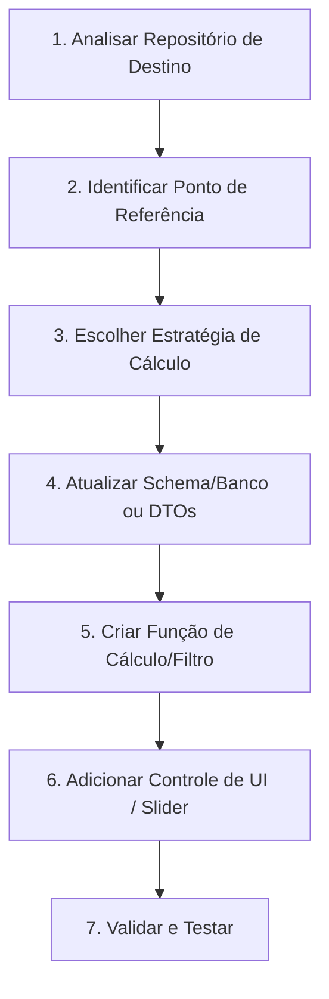

# Skill: Filtro por Raio Geográfico e Ponto de Referência

Esta skill contém a documentação completa, algoritmos, esquemas de banco de dados, APIs de geocodificação e componentes de interface para implantar a funcionalidade de **Filtragem por Raio Geográfico** partindo de um **Ponto de Referência (Ponto A / Sede / Cidade de Origem)** até **Pontos de Destino (Pontos B / Cidades / Oportunidades / Clientes)** em qualquer repositório de software.

## 🎯 Objetivo
Permitir que qualquer assistente LLM (Antigravity, ChatGPT, Claude, Gemini, Copilot, Cursor, etc.), ao receber esta pasta `skills/filtro-por-raio/` em um novo repositório, consiga entender a arquitetura do projeto de destino e implantar o filtro por raio de forma autônoma e consistente.

---

## 🗺️ Estrutura da Documentação

A documentação está dividida em módulos focados para facilitar a leitura e implementação por etapas:

| Arquivo | Descrição | Conteúdo Chave |
| :--- | :--- | :--- |
| [`01_ARQUITETURA_E_CONCEITOS.md`](01_ARQUITETURA_E_CONCEITOS.md) | Conceitos Fundamentais | Ponto de Referência, Raio $R$, Haversine vs Rota Rodoviária (OSRM), Fluxo de Dados |
| [`02_DADOS_CIDADES_E_COORDENADAS.md`](02_DADOS_CIDADES_E_COORDENADAS.md) | Base de Cidades e Geocodificação | Tabela de coordenadas pré-mapeadas, Código IBGE, APIs (IBGE e Nominatim/OSM) |
| [`03_ALGORITMOS_E_CALCULOS.md`](03_ALGORITMOS_E_CALCULOS.md) | Algoritmos de Distância | Implementações da Fórmula Haversine em TS/JS, Python, SQL e integração OSRM |
| [`04_INTEGRACAO_BANCO_DE_DADOS.md`](04_INTEGRACAO_BANCO_DE_DADOS.md) | Banco de Dados & Indexação | SQL PostgreSQL/Supabase, PostGIS (`ST_DWithin`), Prisma, Drizzle e RPC |
| [`05_INTERFACE_E_COMPONENTES_UI.md`](05_INTERFACE_E_COMPONENTES_UI.md) | Frontend & Componentes UI | Componentes React/Vue/HTML: Slider de Raio, Seletor de Origem, Badges de Distância |
| [`06_PROMPT_INSTRUCAO_IMPLANTACAO.md`](06_PROMPT_INSTRUCAO_IMPLANTACAO.md) | Guia de Execução para LLM | Prompt pronto e checklist de implantação passo a passo para o agente de IA |

---

## 🚀 Como Usar esta Pasta em Outro Repositório

1. **Copie a pasta `skills/filtro-por-raio/`** para a raiz do repositório de destino (ou para `.agents/skills/filtro-por-raio/`).
2. **Abra o seu assistente de IA/LLM** no repositório de destino.
3. **Cole a instrução contida no arquivo [`06_PROMPT_INSTRUCAO_IMPLANTACAO.md`](06_PROMPT_INSTRUCAO_IMPLANTACAO.md)** ou peça à LLM:
   > *"Leia o arquivo `skills/filtro-por-raio/SKILL.md` e implante a funcionalidade de filtro por raio geográfico neste projeto."*

---

## ⚡ Protocolo de Execução para o Agente LLM

Ao receber o pedido de implantação, o agente LLM deve seguir rigorosamente estes passos:

1. **Análise do Repositório**: Identificar a stack utilizada (React, Next.js, Node, Python, Supabase, PostgreSQL, etc.) e onde estão listados os itens que serão filtrados.
2. **Ponto de Referência (Origem)**: Identificar como a origem é definida (fixa no `.env`/configuração ou selecionável pelo usuário).
3. **Estratégia de Distância**:
   - **Haversine**: Rápido, local, em memória ou via SQL, sem dependência externa de APIs.
   - **OSRM (Rodoviário)**: Rota real em km e tempo de viagem de carro via API OSRM pública/privada.
4. **Aplicação do Filtro**: Aplicar a condição `distancia_km <= raio_selecionado_km`.
5. **Interface do Usuário**: Inserir slider de raio, badge com distância nos cards/tabelas e opção de limpar filtro.
