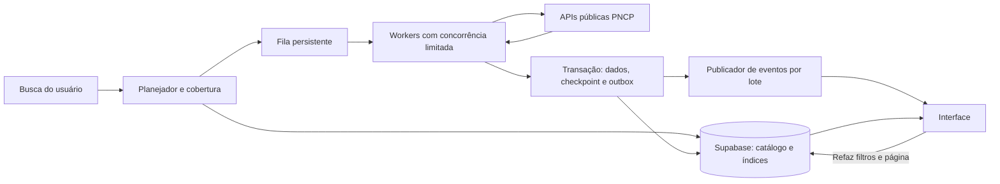

# Ingestão, sincronização e desempenho

## 1. Arquitetura recomendada

O sistema responde ao usuário a partir do Supabase e atualiza o catálogo por tarefas duráveis. O PNCP é uma fonte externa cuja latência, disponibilidade e paginação não são controladas pelo projeto. A separação permite que os resultados já persistidos sejam pesquisáveis enquanto o restante chega.



Componentes lógicos podem viver no backend existente. Não é necessário começar com vários microsserviços nem trocar a stack do projeto. Um worker durável e uma fila persistente são suficientes para uma primeira versão. [Opções e limites Supabase](04_SUPABASE_E_CONSULTAS.md).

Fluxo da requisição do produto:

1. Autenticar/autorizar quando exigido pelo produto e validar os filtros.
2. Normalizar o escopo e consultar cobertura e catálogo.
3. Retornar rapidamente a página já disponível, estado da cobertura e identificador de job quando houver trabalho pendente.
4. Criar/reutilizar segmentos faltantes em uma fila durável.
5. Após cada commit, notificar progresso de forma agrupada; o cliente refaz sua consulta filtrada.

A escolha entre HTTP 200 com resultados parciais e HTTP 202 na criação de job deve seguir o contrato do projeto. Evitar uma única requisição HTTP esperando todos os GETs do PNCP. Não usar atividade em memória depois de responder como único mecanismo de coleta: o processo pode ser encerrado.

## 2. Três trabalhos diferentes

| Trabalho | Fonte e prioridade | Finalidade |
|---|---|---|
| Descoberta de oportunidades | Propostas abertas; alta prioridade | Preencher rapidamente o recorte de interesse, incluindo editais antigos ainda abertos. |
| Sincronização contínua | Atualização global + reconciliação; prioridade reservada | Atualizar cabeçalhos e invalidar detalhes alterados. |
| Enriquecimento/histórico | Detalhes, itens, documentos; conforme necessidade | Atender filtros adicionais e ampliar cobertura sem impedir a exibição de cabeçalhos. |

Não executar todas as etapas em série para cada contratação antes de salvar qualquer resultado. Se uma página já traz os campos da lista, ela pode ser persistida diretamente. [Rotas e campos de consulta](01_PNCP_CONTRATO_E_FILTROS.md), [enriquecimento](08_DETALHAMENTO_E_DOMINIOS.md).

## 3. Coleta inicial de oportunidades

Antes do primeiro GET de descoberta, persistir `bootstrap_started_at` por escopo. Se ainda não há cobertura incremental, inicializar sua janela na data de calendário desse instante menos a sobreposição; não usar o horário do fim da carga ou o maior timestamp dos registros recebidos. Após a descoberta, executar catch-up de atualização global desde esse início até o cutoff fixado para a rodada, por todas as modalidades pertinentes. Assim mudanças ocorridas durante a carga inicial continuam elegíveis para recuperação. Essa passagem não substitui reconciliação de páginas mutáveis nem cobre automaticamente história anterior ao escopo contratado.

1. Definir recorte e horizonte explícitos. Se nenhum recorte geográfico foi escolhido, a consulta é nacional; isso aumenta o volume e precisa aparecer na estimativa.
2. Usar `/contratacoes/proposta` com filtros nativos realmente desejados e `tamanhoPagina=50` inicialmente.
3. Buscar e persistir a primeira página de cada segmento prioritário. Começar por segmentos solicitados, não por um histórico nacional completo.
4. Continuar a paginação com checkpoint e limite global de chamadas.
5. Manter todos os cabeçalhos desse recorte, mesmo os que não correspondem à palavra-chave atual. Assim outros filtros locais podem ser aplicados depois.
6. Agendar itens/documentos necessários em fila própria, com cobertura independente.

Quando o usuário ampliar de SP para Brasil, o catálogo SP continua útil, mas a cobertura nacional fica parcial até terminar o restante. Compartilhar segmentos idênticos evita baixar o mesmo recorte novamente para cada usuário ou palavra-chave.

Um horizonte inicial de 30 dias é uma escolha de produto sugerida no arquivo 02, não uma garantia de abarcar todas as abertas. Se o requisito for todas sem limite de prazo, a equipe deve validar o universo temporal suportado antes de prometer essa cobertura.

## 4. Incremental por atualização global

A rota verificada é `GET /v1/contratacoes/atualizacao`, com datas inicial/final e modalidade obrigatórias. Ela é descrita como consulta por atualização global. Essa data abrange também alterações nos dependentes segundo o manual de integração. Portanto, um edital publicado há anos pode aparecer no incremental de hoje. [OpenAPI](https://pncp.gov.br/api/consulta/v3/api-docs), [Manual §11.5](https://pncp.gov.br/manual/pt-br/latest/singlehtml/).

Algoritmo recomendado:

1. Manter progresso por escopo/partição/modalidade, com assinatura estável e versão do catálogo de domínios.
2. No início do ciclo, fixar `run_started_at` e a última data de calendário a consultar. O endpoint aceita datas, não um cutoff em segundos.
3. Calcular início como última cobertura menos a sobreposição configurada. Reconsultar a data corrente; ela permanece provisória enquanto o dia está em andamento.
4. Percorrer janelas de datas e modalidades necessárias, usando filtros nativos seguros ao universo mantido.
5. Gravar páginas com upsert/merge idempotente. Alteração global invalida o enriquecimento correspondente quando a versão anterior não é suficiente.
6. Avançar cobertura da partição somente quando todas as suas páginas tiverem commit. A visão agregada não ultrapassa a partição pendente mais antiga relevante.
7. Próximo ciclo reconsulta a fronteira/sobreposição e os períodos não concluídos.

Não usar `max(dataAtualizacaoGlobal)` de uma única página como checkpoint completo. Não marcar o horário final do job como “sincronizado até agora”: o plano usou um recorte fixado antes, e a fonte não forneceu snapshot. Guardar separadamente “consultado em”, “última data fechada percorrida”, “dia corrente provisório” e “última atualização observada”.

Configuração inicial ilustrativa: ciclos a cada 10 minutos, sobreposição de 2 dias e janelas de 1 a 7 dias. São escolhas conservadoras para calibrar por volume e atraso observado; não são limites ou SLAs do PNCP. Se atrasos de indexação excederem a sobreposição, a reconciliação precisa recuperar as lacunas.

Usar o domínio de modalidades atual. Para cobertura ampla não restringir a códigos antigos ou somente a ativos sem avaliar registros históricos. Um novo código pode exigir adicionar partições e reavaliar cobertura.

## 5. Saídas do recorte e exclusões

Uma atualização filtrada por UF/modalidade representa registros que a fonte encontra com esses filtros naquele momento. Se um registro mudar uma dimensão filtrada, pode sair do recorte e não aparecer mais no seu incremental. Tratar isso explicitamente:

- Reconsultar identidades de oportunidades acompanhadas, principalmente com prazo próximo, situação incerta ou que sumiram da varredura de propostas.
- Renovar a descoberta por propostas para localizar novas entradas e comparar observações.
- Para escopos pequenos e catálogo com necessidade forte de consistência, usar incremental menos restrito nas dimensões mutáveis quando viável, e aplicar o filtro local.
- Fazer reconciliação periódica de escopos e detalhes, priorizada por relevância/idade. Manter cobertura desatualizada quando a verificação não puder ser concluída.

Não inferir exclusão por ausência em uma página, 204, 404 isolado ou saída do conjunto de abertas. A API de integração tem histórico por contratação, mas não há garantia verificada de um feed global de tombstones nem de histórico disponível após exclusão total. Manter estado de ausência suspeita e evidência antes de marcar remoção confirmada. [Histórico oficial](https://pncp.gov.br/manual/pt-br/latest/contratacao/consultar_historico_da_contratacao.html).

## 6. Paginação e segmentação sem lacunas silenciosas

A API usa página começando em 1 e envelope com total de registros/páginas. Não oferece cursor de snapshot no contrato examinado. Inserções, retificações e remoções durante a leitura podem deslocar registros entre páginas. Deduplicação corrige repetições, mas não recupera sozinha os registros saltados. [OpenAPI](https://pncp.gov.br/api/consulta/v3/api-docs).

Política base:

1. Processar páginas sequencialmente dentro de um segmento; paralelizar primeiro segmentos independentes.
2. Validar que `numeroPagina` corresponde à página pedida, `data` tem o formato esperado e os metadados não são contraditórios.
3. Em 200 válido, persistir a página; usar metadados observados para continuar. Página cheia pode ser a última; página curta não deve contrariar metadados silenciosamente.
4. Em 204 sem corpo, registrar observação sem conteúdo. Se contradiz contagem/páginas esperadas, marcar instabilidade e reconciliar; se o segmento estava vazio de forma coerente, encerrá-lo como observado.
5. Em total alterado/páginas repetidas/metadados impossíveis, registrar evento de instabilidade; limitar a rodada por orçamento e reagendar. Não entrar em loop infinito tentando alcançar um conjunto móvel.
6. Fazer uma nova passagem/reconciliação quando houver mudança observada, fronteira ativa ou retomada após longo intervalo. Registrar gerações e instantâneos das contagens, sem misturá-las como prova de snapshot.

Em publicação/atualização, dividir períodos com datas de calendário. Exemplo: `[01/09,07/09]`, depois `[08/09,14/09]`, validando inclusividade e fronteiras com testes. Não usar o dia final de uma janela como início da próxima por acidente; quando houver sobreposição deliberada, registrá-la e deduplicar. Se uma janela tiver muitas páginas ou latência excessiva, subdividi-la antes da varredura completa. Um único dia ainda pode ser dividido por UF/órgão/modalidade quando necessário e compatível com a cobertura.

Em propostas, não há início temporal para construir essas janelas disjuntas. Repetir horizontes cumulativos pode desperdiçar chamadas. Um novo horizonte maior pode exigir reler uma parte já conhecida; isso deve entrar na estimativa, sem alegar que a API permite pedir somente a diferença temporal.

## 7. Estado durável, transação e retomada

Cada segmento deve registrar: identificador, endpoint, query normalizada, janela/horizonte, tamanho de página, geração, versão do contrato, próxima página, páginas aplicadas, contagens, estado, tentativa, `next_attempt_at`, posse/lease, token de geração da posse e erros resumidos. Uma mudança de filtros, tamanho ou janela cria nova assinatura; não reutilizar o checkpoint antigo.

Estados sugeridos: `pending`, `running`, `retry_wait`, `completed`, `partial`, `failed`, `cancelled`. Falhar ou cancelar um job não apaga páginas já persistidas e não conclui segmentos pendentes.

Pseudocódigo conceitual, a adaptar à fila/banco do projeto:

```text
claim(segmento) -> lease_token
resposta = GET pagina com timeout e limite global
se 429/transitório: reagendar duravelmente; não avançar checkpoint
se 204: tratar ausência conforme consistência do segmento
se 200: validar envelope; normalizar e deduplicar lote

transação:
  validar que lease_token ainda possui o segmento
  se batch_id já aplicado: não repetir efeitos
  mesclar cabeçalhos usando versão/hash e identidade canônica
  registrar dependentes pendentes quando necessário
  registrar batch_id e contagens sem duplicação
  avançar checkpoint após aplicação completa
  inserir evento pequeno na outbox
commit

confirmar mensagem da fila
publicar outbox após commit, com deduplicação/agrupamento
```

Buscar a rede fora da transação, para não manter locks durante latência externa. Conferir posse e versão dentro da transação de commit. Um lease expirado precisa impedir o antigo worker de gravar progresso depois do sucessor; usar um token/fencing verificado atomicamente. Nenhum checkpoint deve avançar se o lote correspondente não foi aplicado.

Definir unicidade para registro canônico e lote aplicado. Para mesma versão com payload divergente, serializar reconciliação por identidade. Não deixar a resposta mais lenta vencer apenas por chegar depois. Ausência de campo em uma listagem não apaga detalhe já adquirido; null explícito pode ter outro significado. [Escrita e política de versões](04_SUPABASE_E_CONSULTAS.md).

## 8. Concorrência, retries e pressão da fonte

Não foi identificada quota oficial de RPS/conexões nos documentos examinados. Criar limites de aplicação, sem apresentá-los como permissão do PNCP. Começar, por exemplo, com **2 requisições simultâneas globais e no máximo 2 partidas por segundo** para a integração, com filas limitadas e reutilização de conexão. Aumentar só após medir ganho, estabilidade e respostas do provedor; a configuração inicial tampouco garante ausência de limitação.

O limitador deve ser compartilhado por todos os workers, jobs, tentativas e tipos de enriquecimento que usam o mesmo provedor. Dez workers com “2 cada” não atendem a um limite global de 2. Separar reservas de capacidade para descoberta/sincronização e enriquecimento sem ultrapassar o total.

Política de falhas proposta:

| Falha | Ação |
|---|---|
| 400/422 | Falha de validação/contrato; corrigir, sem repetir a mesma consulta indefinidamente. |
| 401/403 em leitura pública | Registrar endpoint/resposta sanitizada e investigar; não inventar login nem contornar bloqueios. |
| 429 | Respeitar Retry-After em segundos ou data HTTP; reduzir pressão global; reagendar a mensagem. |
| Timeout, reset de conexão, 500/502/503/504 transitório | Backoff exponencial com jitter e orçamento finito, conservando progresso. |
| JSON inválido/HTML/campo de identidade ausente | Falha observável; não persistir como lote válido nem declarar completo. |
| Banco indisponível/lento | Interromper avanço e reduzir aquisição; repetir lote idempotente quando recuperado. |

Ponto de partida ajustável: timeout total de 30 s por GET, 5 tentativas totais por página, backoff aleatório até `min(60 s, 1 s × 2^tentativa)`. Um Retry-After válido maior que 60 s prevalece; não antecipar o retry pelo teto. Se a espera exceder o orçamento do job/runtime, reagendar para depois ou marcar pendente com motivo. A primeira página medida de propostas levou 19,6 s; não fixar timeout curto presumindo fonte instantânea.

Usar conexão persistente, compressão se negociada/suportada pelo cliente e servidor, e limite de bytes da resposta descomprimida. Não há suporte a ETag/Last-Modified confirmado por esta pesquisa: só usar GET condicional depois de verificar os cabeçalhos reais. Hash local evita escrita repetida, mas não economiza a transferência da fonte.

## 9. Estimar duração corretamente

Para `S` segmentos, com `N_s` registros e tamanho de página `P_s`, uma aproximação do total de requisições de listagem é:

```text
R_listagem ≈ soma(max(1, ceil(N_s / P_s)))
R_total = R_listagem + R_detalhes + R_itens + R_documentos
          + R_retries + R_reconciliacao
T_rede_aprox >= max(R_total × L_medio / C, R_total / Q)
```

`C` é concorrência útil permitida pela aplicação; `Q` é teto de requisições por segundo configurado; `L` é latência medida representativa. Dependências de paginação, conexão, limites da fonte, gravação e variação de payload podem tornar o tempo maior. As fórmulas são estimativas, não garantias; não usar os seis testes pontuais como percentis.

Exemplo hipotético sem enriquecimento: 10.000 cabeçalhos em um segmento de 50 dão 200 páginas. Com 1 s/página, sequência de um único segmento leva aproximadamente 200 s de rede. Se houver segmentos realmente independentes e concorrência útil 2, o ideal aproximado pode cair para 100 s, antes de outros custos. Com 20 s/página, a sequência já teria cerca de 67 minutos. Para 1 milhão de cabeçalhos seriam 20.000 páginas antes dos detalhes. Acrescentar um GET de itens por contratação pode dominar todo o custo.

Conclusão operacional: a maior economia costuma vir de **reduzir universo necessário, reaproveitar cobertura, evitar GETs por registro desnecessários e sincronizar mudanças**. Concorrência ajuda até o gargalo da fonte/banco; multiplicá-la indiscriminadamente não resolve volume nem latência externa.

## 10. Atualidade e reconciliação

Configurações iniciais para experimento em homologação, a ajustar à relevância e volume:

| Parâmetro | Proposta inicial | Observação |
|---|---|---|
| Atualização global | A cada 10 min | Escopos ativos; não garantia de refletir publicação em 10 min. |
| Sobreposição incremental | 2 dias | Reavaliar com atraso de publicação/indexação observado. |
| Nova varredura de propostas | A cada 30 min nos escopos ativos | Recalibrar; volume nacional pode exceder a capacidade disponível. |
| Verificar identidades importantes | Conforme proximidade do prazo/idade | Priorizar registros acompanhados; evitar detalhe de todo catálogo a cada ciclo. |
| Reconciliação mais ampla | Diária, fracionada | Dividir para não bloquear coleta prioritária; necessário para mudanças tardias e saídas de filtro. |
| Atualizar domínios | Diariamente e ao detectar código novo | Não usar enum congelado indefinidamente. |

Calcular a demanda antes de habilitar frequências: `requisições por ciclo / intervalo` somada para todos os escopos e recursos precisa caber no orçamento global com folga para falhas. Se não couber, consolidar escopos, priorizar, ampliar intervalos e informar a idade real. Não empilhar ciclos idênticos quando o anterior ainda está rodando; usar single-flight por assinatura e reagendamento coalescido.

Um usuário alterando filtros locais não deve disparar esse cronograma repetidamente. Um escopo abandonado pode perder prioridade. Cancelar uma busca privada não cancela automaticamente um segmento compartilhado que outros jobs ainda necessitam.

## 11. Métricas e etapas de entrega

Medir: tempo até primeira página já salva; tempo até primeira página vinda da fonte; tempo até concluir cabeçalhos; tempo até concluir itens/documentos exigidos; latência PNCP por endpoint/status; bytes por página; pedidos evitados; espera da fila; tentativas; tempo de commit; queries filtradas p95; idade da cobertura; atraso de eventos; conflitos de versão; páginas inconsistentes e falhas em quarentena.

Etapas sugeridas para a implementação futura:

1. **Contrato e modelo:** adaptar nomes ao projeto, captura de capacidades, identidade e cobertura.
2. **Caminho mínimo:** coletar propostas de um recorte pequeno, persistir por página e consultar no Supabase.
3. **Confiabilidade:** fila durável, checkpoint/merge/outbox atômicos, limites globais e testes de crash.
4. **Atualidade:** atualização global, domínios, sobreposição, passagem de prazos e reconciliação.
5. **Filtros avançados:** itens/documentos sob demanda com completude própria.
6. **Calibração:** benchmark local com fonte simulada e smoke pequeno na API oficial, sem teste de carga.

Cada etapa precisa passar os critérios pertinentes do [plano QA](05_QA_E_CRITERIOS_DE_ACEITE.md). Não há migrações ou serviços implantados como parte desta documentação.
